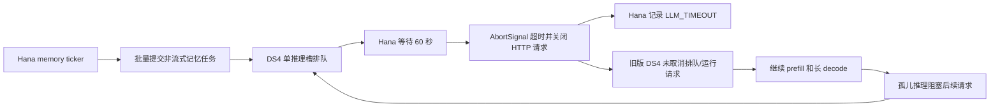

# OpenHanako 后台记忆任务导致 DS4 孤儿推理的分析

日期：2026-07-16

状态：P0 已实施，待真实 Hana 运行验证

## 结论

本次 DS4 长队列的主因不是 51.2K 上下文、Metal 吞吐下降或 MTP 未启用，而是 OpenHanako 后台记忆任务在客户端 60 秒超时后，DS4 仍继续执行已经无人接收的非流式请求。

在首次启动批次中，OpenHanako 发出 16 个后台记忆请求，客户端全部记录为 `LLM_TIMEOUT`；DS4 随后仍完成全部请求，累计生成 26,220 个无人消费的输出 token，并从 11:31:48 持续占用推理槽到 12:04:47。该批次合计包含 34,405 个 prompt token，并命中 2,048 个 cached token。

队列清空后，同类任务分别在 36.5 秒和 25.1 秒内成功，说明此前的连续超时主要由孤儿请求叠加和队首阻塞造成。

P0 服务端修复现已实施：DS4 会在非流式 job 出队时丢弃已断连请求，并在 active prefill/decode 期间通过 session cooperative cancellation 探测客户端放弃。取消请求使用独立的 `cancelled` 状态，清理不完整的 live session 状态，跳过后处理与最终响应。当前结论已由 server 单元测试和 CPU 构建验证，但尚未用真实 Hana、真实模型和生产 Metal/SSD 路径复现 60 秒超时批次，因此状态仍为“待真实 Hana 运行验证”。

## 环境

- OpenHanako：`0.403.0-darwin-arm64`
- OpenHanako 仓库提交：`12f275bc47c5e7907792b11c48c83bc1087014e4`
- DS4：Metal 后端，单实例
- DS4 启动上下文：`--ctx 51200`
- DS4 prefill chunk：`--prefill-chunk 5120`
- OpenHanako 本地模型声明：
  - `contextWindow: 1000000`
  - `maxTokens: 384000`
- OpenHanako 默认会话压缩设置：
  - `reserveTokens: 16384`
  - `keepRecentTokens: 20000`

OpenHanako 声明的上下文窗口为 1,000,000，而 DS4 实际上限为 51,200。该错配不是本次后台记忆批次的直接触发原因，但会导致会话压缩阈值、输出预算和超窗保护基于错误容量计算。

## 请求来源确认

Hana 的 `usage-ledger.json` 将 16 个请求明确标记为后台记忆任务：

| 操作 | 数量 | 调度方式 | 输出预算 | 客户端超时 |
|---|---:|---|---|---:|
| `memory/rolling_summary` | 7 | 按轮次、session 结束或启动恢复 | 可见输出约 150–750 token，再为 reasoning 增加 1024 token buffer | 60 秒 |
| `memory/compile_longterm` | 1 | 每日记忆流水线 | 600 token，再为 reasoning 增加 1024 token buffer | 60 秒 |
| `memory/extract_facts` | 8 | 每日深度记忆，每批最多 3 个并发 | 4096 token | 60 秒 |

OpenHanako 源码依据：

- [lib/memory/memory-ticker.ts](https://github.com/liliMozi/openhanako/blob/12f275bc47c5e7907792b11c48c83bc1087014e4/lib/memory/memory-ticker.ts)：每 10 轮触发滚动摘要、启动恢复和每日流水线。
- [lib/memory/session-summary.ts](https://github.com/liliMozi/openhanako/blob/12f275bc47c5e7907792b11c48c83bc1087014e4/lib/memory/session-summary.ts)：滚动摘要预算与 `timeoutMs: 60_000`。
- [lib/memory/deep-memory.ts](https://github.com/liliMozi/openhanako/blob/12f275bc47c5e7907792b11c48c83bc1087014e4/lib/memory/deep-memory.ts)：`MAX_CONCURRENT = 3`、`maxTokens: 4096` 和 `timeoutMs: 60_000`。
- [lib/memory/llm-budget.ts](https://github.com/liliMozi/openhanako/blob/12f275bc47c5e7907792b11c48c83bc1087014e4/lib/memory/llm-budget.ts)：reasoning 模型默认增加 1024 token 输出 buffer。
- [core/llm-client.ts](https://github.com/liliMozi/openhanako/blob/12f275bc47c5e7907792b11c48c83bc1087014e4/core/llm-client.ts)：非流式 `fetch`、默认 60 秒超时和 `AbortSignal.timeout()`。

这批请求不是 OpenHanako 的会话上下文 compaction。会话 compaction 是另一条链路；本次调用来自 memory ticker 的滚动摘要、长期记忆编译和事实提取。

## 时间线

| 本地时间 | 事件 |
|---|---|
| 11:31:48 | Hana memory ticker 启动，第一个滚动摘要请求进入 DS4 |
| 11:32–11:37 | 7 个滚动摘要陆续在 Hana 侧达到 60 秒超时 |
| 11:37:49 | 每日记忆任务开始 |
| 11:38:49 | `compile_longterm` 超时；8 个脏 session 开始事实提取 |
| 11:39–11:41 | `extract_facts` 按 3、3、2 的批次全部超时 |
| 11:41:49 | Hana 侧最后一个首次批次请求已经超时 |
| 12:04:47 | DS4 才完成最后一个孤儿请求，后台积压清空 |
| 12:31:48 | 每日任务重试，`compile_longterm` 在 36.5 秒内成功 |
| 12:38:54 | 滚动摘要再次触发，命中 2048 token KV，在 25.1 秒内成功 |

首次批次的 DS4 汇总：

| 指标 | 数值 |
|---|---:|
| 请求数 | 16 |
| prompt token | 34,405 |
| cached token | 2,048 |
| 无人消费的 output token | 26,220 |
| 首个请求进入 | 11:31:48 |
| 最后请求结束 | 12:04:47 |

## 根因链路

DS4 已有 cooperative cancellation API：[`ds4.h`](../ds4.h) 中的 `ds4_session_set_cancel()`。旧版 [`ds4_server.c`](../ds4_server.c) 没有为 HTTP job 安装该回调。流式请求会在 prefill 中发送 keepalive 并发现断连；非流式请求通常直到生成结束才首次写响应，因此客户端超时后服务器仍不知道结果已无人接收。

## P0 实施结果

### 排队请求直接丢弃

worker 从队列取出 job 后、设置 active call 和进入 prefill 前，先探测非流式 socket。若客户端已经断开：

- job 不进入 `generate_job()`，不消耗 prefill/decode；
- call history 以 `DS4_CALL_CANCELLED`、`finish=cancelled`、`output_tokens=0` 结束；
- 原因记录为 `client disconnected while queued`；
- 不启动 active request status，因此不会把这个从未开始推理的 job 计作模型完成或模型失败。

这条路径直接覆盖本次事故中“多数请求等待超过 60 秒、真正出队前客户端已经超时”的主要浪费。

### active session callback

非流式 active job 会通过 `ds4_session_set_cancel(session, server_job_cancel_cb, job)` 安装回调，job 完成后立即清除。回调对 socket 做非阻塞探测，并复用 DS4 prefill/backend 已有的 cooperative cancellation 检查点。流式 job 不安装该回调。

### prefill 中断、disk cache 与 session 失效

prefill 将 `DS4_SESSION_SYNC_INTERRUPTED` 与同步成功后发现的客户端断连都映射为 `cancelled`，而不是普通 prefill error。取消路径会：

- 释放临时 prompt/prefix；
- 清除 progress callback；
- 恢复被暂时抑制的 continued-checkpoint 调度；
- 调用 `ds4_session_invalidate()`，并重置 continued store frontier；
- 清除 Responses、Anthropic 与 thinking live state，防止不完整前缀污染下一请求；
- 只释放当前 `disk_cache_path` 字符串，不调用失败路径的 disk-entry discard，因此不会删除此前已验证健康的 disk checkpoint。

普通 prefill 失败仍保留原有的损坏/失败 disk entry 清理逻辑；“取消”与“缓存文件失败”不再混为一谈。真实 SSD streaming 与真实 disk checkpoint 恢复尚未运行，因此这里的结论目前来自代码路径和 server 单元测试，不等同于生产模型验证。

### decode token 与 MTP 边界

decode 在以下边界探测非流式客户端断连：

- 每轮采样开始前；
- 单 token eval 或 speculative MTP eval 返回后；
- 消费 MTP 返回批次中的每个 token 前；
- decode 循环结束后；
- 工具调用恢复、消息解析、live-state 记忆和最终响应之前。

因此普通 token decode 与一次返回多个候选 token 的 MTP 路径都能在有限边界内停止；取消时不会继续消费剩余 MTP token。prefill 则继续复用 backend 已有的 cooperative callback 检查点。

### 跳过后处理与最终响应

一旦 `final_finish` 为 `cancelled`，服务端不会继续执行取消结果的消息解析、tool-call 记忆、Responses/Anthropic/thinking live checkpoint 更新，也不会尝试写非流式最终 HTTP 响应。取消路径只保留无正文的 trace/status/call-history 终态，并清理 live session 状态。

### 独立 cancelled 状态与 JSON

- `ds4_call_status` 新增 `DS4_CALL_CANCELLED`，不复用 `DS4_CALL_FAILED`；
- call history JSON 中记录 `status: "cancelled"` 和 `finish: "cancelled"`；
- active request status 使用独立的 `cancelled_requests` 饱和计数；
- `/ds4/status` 的 `totals` JSON 新增 `cancelled` 字段；
- dashboard 将该终态显示为“已取消”，并可按该结果筛选；
- caller 聚合只把 `DS4_CALL_FAILED` 计入 failures，取消不污染模型失败率。

queued drop 会结束对应的 call-history 记录，但因为从未调用 active request begin，不会改动 active request 的 total/completed/failed/cancelled 计数。这与“未进入模型执行”的语义一致。

### writer 返回值

三个非流式最终响应 writer 的既有 `bool` 返回值现在都会传给 call-history finalizer。若请求没有在最终写之前被判定为取消，但实际 write 已失败，则终态为 `error` 并记录 `client stream write failed`，不再把未送达的响应误记为成功完成；SSE 写失败路径保持原有行为。

### TCP 语义取舍

DS4 的 HTTP 实现是单请求连接：服务端完整读取一个 request body，处理一个请求，并以 `Connection: close` 结束连接。在这个契约下，body 已读完后的 peer EOF 被解释为客户端已经放弃本请求；该 EOF 包括客户端调用 `shutdown(SHUT_WR)` 只关闭发送方向的情况。

这是被动 TCP 探测的明确取舍：服务端无法仅凭 EOF 区分“客户端完整关闭连接”与“客户端只关闭发送方向、仍计划读取响应”。因此，一个在发送完整请求后主动 `SHUT_WR`、但仍等待响应的非流式客户端也会被 DS4 视为放弃。OpenHanako 的 `fetch` + `AbortSignal.timeout()` 目标路径在超时后会关闭/中止请求，符合当前取舍；若未来需要支持 half-close 后继续读响应的客户端，必须引入更明确的应用层取消信号或调整连接协议，不能靠被动 TCP 无歧义判断。

### 流式请求保持原有路径

新增的 queued EOF drop、session cancel callback 与 decode peer probe 都只作用于 `stream=false`。流式请求继续使用既有的 SSE header/keepalive/增量写入失败来发现断连；本次 P0 不把流式连接的正常读侧状态解释为 cooperative cancellation。writer 返回值只让既有写失败能正确传播到终态。

## 后续优先级

### P1：修正 OpenHanako 本地模型容量声明

将 `contextWindow` 调整为 DS4 实际的 51,200。`maxTokens` 应设置为不超过真实剩余上下文的值，具体上限需结合日常输出需求单独验证，不能继续使用 384,000。

### P1：限制后台记忆并发

DS4 当前同一时间只推进一个请求，`extract_facts` 的 3 路并发不会增加总吞吐，只会放大排队和超时。OpenHanako 对同一串行本地 provider 应使用全局并发 1，或让后台记忆任务走低优先级队列。

### P2：调整 Hana 超时或模型分流

- 在真实 Hana 验证 DS4 断连取消后，再根据本机实测把记忆任务 timeout 调整到合理范围。
- 若记忆质量允许，可将事实提取等任务分流到更快的 utility model。
- 不建议仅把超时从 60 秒无限增大；这会减少误超时，但不能解决前台请求被后台任务阻塞的问题。

## 验证结果

验证日期：2026-07-16。验证工作目录：`/Users/shc/ds4/.worktrees/http-client-cancellation`。

| 验证项 | 结果 | 核心证据或限制 |
|---|---|---|
| TDD RED | 符合预期 | 未保留/不虚构逐行日志。新增测试最初依次暴露缺少 `cancelled_requests`、`DS4_CALL_CANCELLED`、`server_client_disconnected` 与 queued-drop helper 的编译期 RED；补齐 API 后，active-cancel helper 因尚未清理 live/continued 状态出现行为 RED。dashboard 补测也先以缺少“已取消”选项和文案映射的 2 个断言失败，再补实现转绿。 |
| `make clean && make ds4_test && ./ds4_test --server` | 通过，exit 0 | 从干净构建产物编译 Metal test runner；`server: OK`、`ds4 tests: ok`。Metal SDK 输出 24 条既有 `didModifyRange:` deprecated warning，无 error。 |
| `make ds4-server` | 通过，exit 0 | 生产 Metal server 完成编译和链接；`ds4_server.c` 有 5 条既有 unused function warning，无 error。 |
| `make cpu` | 通过，exit 0 | CPU 版 `ds4`、`ds4-server`、`ds4-bench`、`ds4-eval`、`ds4-agent` 均完成链接。共有 13 条既有 unused function/parameter warning（`ds4_server.c` 5 条、`ds4.c` 8 条），无 error。 |
| `make ds4_test && ./ds4_test --server`（CPU target 后复测） | 通过，exit 0 | 再次得到 `server: OK`、`ds4 tests: ok`；输出包含 `dropping queued request after client disconnected`，确认最新整棵工作树的 queued-drop 与 dashboard 测试均实际执行。 |
| `git diff --check` | 通过，exit 0 | 对已跟踪差异无输出；另用尾随空白搜索和末尾换行检查覆盖两份未跟踪中文文档，也均通过。 |
| `make test` / `./ds4_test --all` | 未运行 | 早期验证时存在活动大模型服务；最终安全重跑前该进程已自然退出，但本轮仍不为 HTTP 生命周期修复主动加载巨大模型。该目标不会覆盖真实 Hana 的断连场景，额外资源风险大于本轮增量验证价值。 |

### 活动进程判断

早期验证前运行 `pgrep` 并进一步用 `ps` 核实：PID 71944 是已运行约 3.5 小时的真实 `./ds4-server --ctx 51200 ...` 大模型服务，而不是查询命令自匹配，因此当时没有运行 `make test`。最终从干净构建产物重跑前，该 PID 已不存在，精确 `pgrep` 无输出；本轮始终没有向该进程发送信号，没有启动或重启 server，也没有发起模型推理。

### 尚未验证的范围

| 范围 | 状态 | 原因与风险 |
|---|---|---|
| 真实 Hana 60 秒超时批次 | 未验证 | 未让 OpenHanako 重放 16 个 memory 请求；仍需确认 queue depth 能在超时后及时归零、孤儿 output token 接近 0、前台 TTFT 恢复。 |
| 真实模型推理 | 未验证 | 早期存在活动大模型服务；其自然退出后也没有仅为本轮验证重新加载巨大模型。 |
| Metal whole-model graph | 未验证 | 本轮只运行无模型的 server tests 和 CPU build，没有执行 Metal 数值或长上下文回归。 |
| SSD streaming / 真实 disk KV | 未验证 | 没有加载模型或运行 SSD expert streaming；健康 disk checkpoint 的保留还需生产路径验证。 |
| CUDA | 未验证 | 当前为 macOS/Metal 环境，没有可用 CUDA 运行环境。 |
| distributed inference | 未验证 | 未配置分布式节点，也没有启动跨节点推理。 |

真实 Hana 验证建议记录修复前后：queued job 丢弃数、active cancelled 数、孤儿 output token、队列清空时间、前台 TTFT，以及取消后下一请求的 logits/KV 前缀与 disk cache 命中情况。

## 隐私边界

本分析只读取请求元数据、usage ledger 的操作类型、token 计数、状态和程序日志；未读取、记录或引用任何用户提示词、模型回复正文、记忆内容或会话文件正文。
