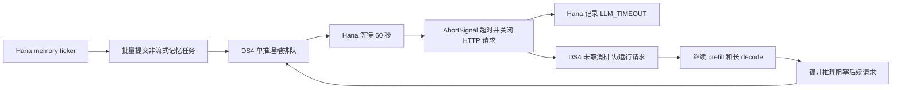

# OpenHanako 后台记忆任务导致 DS4 孤儿推理的分析

日期：2026-07-16  
状态：已定位，尚未实施修复

## 结论

本次 DS4 长队列的主因不是 51.2K 上下文、Metal 吞吐下降或 MTP 未启用，而是 OpenHanako 后台记忆任务在客户端 60 秒超时后，DS4 仍继续执行已经无人接收的非流式请求。

在首次启动批次中，OpenHanako 发出 16 个后台记忆请求，客户端全部记录为 `LLM_TIMEOUT`；DS4 随后仍完成全部请求，累计生成 26,220 个无人消费的输出 token，并从 11:31:48 持续占用推理槽到 12:04:47。

队列清空后，同类任务分别在 36.5 秒和 25.1 秒内成功，说明此前的连续超时主要由孤儿请求叠加和队首阻塞造成。

## 环境

- OpenHanako：`0.403.0-darwin-arm64`
- OpenHanako 仓库提交：`12f275bc47c5e7907792b11c48c83bc1087014e4`
- DS4：Metal 后端，单实例
- DS4 启动上下文：`--ctx 51200`
- DS4 prefill chunk：`--prefill-chunk 5120`
- OpenHanako 本地模型声明：
  - `contextWindow: 1000000`
  - `maxTokens: 384000`
- OpenHanako 默认会话压缩设置：
  - `reserveTokens: 16384`
  - `keepRecentTokens: 20000`

OpenHanako 的模型元数据与 DS4 实际上下文上限明显不一致。该错配不是本次后台记忆批次的直接触发原因，但会导致会话压缩阈值、输出预算和超窗保护基于错误容量计算。

## 请求来源确认

Hana 的 `usage-ledger.json` 将 16 个请求明确标记为后台记忆任务：

| 操作 | 数量 | 调度方式 | 输出预算 | 客户端超时 |
|---|---:|---|---|---:|
| `memory/rolling_summary` | 7 | 按轮次、session 结束或启动恢复 | 可见输出约 150–750 token，再为 reasoning 增加 1024 token buffer | 60 秒 |
| `memory/compile_longterm` | 1 | 每日记忆流水线 | 600 token，再为 reasoning 增加 1024 token buffer | 60 秒 |
| `memory/extract_facts` | 8 | 每日深度记忆，每批最多 3 个并发 | 4096 token | 60 秒 |

OpenHanako 源码依据：

- [`lib/memory/memory-ticker.ts`](https://github.com/liliMozi/openhanako/blob/12f275bc47c5e7907792b11c48c83bc1087014e4/lib/memory/memory-ticker.ts)：每 10 轮触发滚动摘要、启动恢复和每日流水线。
- [`lib/memory/session-summary.ts`](https://github.com/liliMozi/openhanako/blob/12f275bc47c5e7907792b11c48c83bc1087014e4/lib/memory/session-summary.ts)：滚动摘要预算与 `timeoutMs: 60_000`。
- [`lib/memory/deep-memory.ts`](https://github.com/liliMozi/openhanako/blob/12f275bc47c5e7907792b11c48c83bc1087014e4/lib/memory/deep-memory.ts)：`MAX_CONCURRENT = 3`、`maxTokens: 4096` 和 `timeoutMs: 60_000`。
- [`lib/memory/llm-budget.ts`](https://github.com/liliMozi/openhanako/blob/12f275bc47c5e7907792b11c48c83bc1087014e4/lib/memory/llm-budget.ts)：reasoning 模型默认增加 1024 token 输出 buffer。
- [`core/llm-client.ts`](https://github.com/liliMozi/openhanako/blob/12f275bc47c5e7907792b11c48c83bc1087014e4/core/llm-client.ts)：非流式 `fetch`、默认 60 秒超时和 `AbortSignal.timeout()`。

这批请求不是 OpenHanako 的会话上下文 compaction。会话 compaction 是另一条链路；本次调用来自 memory ticker 的滚动摘要、长期记忆编译和事实提取。

## 时间线

| 本地时间 | 事件 |
|---|---|
| 11:31:48 | Hana memory ticker 启动，第一个滚动摘要请求进入 DS4 |
| 11:32–11:37 | 7 个滚动摘要陆续在 Hana 侧达到 60 秒超时 |
| 11:37:49 | 每日记忆任务开始 |
| 11:38:49 | `compile_longterm` 超时；8 个脏 session 开始事实提取 |
| 11:39–11:41 | `extract_facts` 按 3、3、2 的批次全部超时 |
| 11:41:49 | Hana 侧最后一个首次批次请求已经超时 |
| 12:04:47 | DS4 才完成最后一个孤儿请求，后台积压清空 |
| 12:31:48 | 每日任务重试，`compile_longterm` 在 36.5 秒内成功 |
| 12:38:54 | 滚动摘要再次触发，命中 2048 token KV，在 25.1 秒内成功 |

首次批次的 DS4 汇总：

| 指标 | 数值 |
|---|---:|
| 请求数 | 16 |
| prompt token | 34,405 |
| cached token | 2,048 |
| output token | 26,220 |
| 首个请求进入 | 11:31:48 |
| 最后请求结束 | 12:04:47 |

## 根因链路

```mermaid
flowchart LR
    A["Hana memory ticker"] --> B["批量提交非流式记忆任务"]
    B --> C["DS4 单推理槽排队"]
    C --> D["Hana 等待 60 秒"]
    D --> E["AbortSignal 超时并关闭 HTTP 请求"]
    E --> F["Hana 记录 LLM_TIMEOUT"]
    E --> G["DS4 未取消排队/运行请求"]
    G --> H["继续 prefill 和长 decode"]
    H --> I["孤儿推理阻塞后续请求"]
    I --> C
```

DS4 已有 cooperative cancellation API：[`ds4.h`](../ds4.h) 中的 `ds4_session_set_cancel()`。但当前 [`ds4_server.c`](../ds4_server.c) 没有为 HTTP job 安装该回调。流式请求会在 prefill 中发送 keepalive 并发现断连；非流式请求通常直到生成结束才首次写响应，因此客户端超时后服务器仍不知道结果已无人接收。

## 修复优先级

### P0：DS4 服务端取消孤儿请求

1. job 出队、开始 prefill 前检查 HTTP peer 是否已经断开；断开则直接丢弃。
2. 为 active job 安装 `ds4_session_set_cancel()`，在 prefill/decode 的 cooperative cancellation 检查点探测 socket EOF、`POLLHUP`、`POLLERR` 或 `POLLNVAL`。
3. 将这类调用记为 `cancelled`，不要当作模型失败，也不要继续写最终 HTTP 响应。
4. 验证取消后的 session/KV 状态不会保留不完整前缀或污染下一请求。

仅完成“出队前断连检查”就能消除本次大部分浪费，因为绝大多数请求在真正开始推理前已经在 Hana 侧超时。

### P1：修正 OpenHanako 本地模型容量声明

将 `contextWindow` 调整为 DS4 实际的 51,200。`maxTokens` 应设置为不超过真实剩余上下文的值，具体上限需结合日常输出需求单独验证，不能继续使用 384,000。

### P1：限制后台记忆并发

DS4 当前同一时间只推进一个请求，`extract_facts` 的 3 路并发不会增加总吞吐，只会放大排队和超时。OpenHanako 对同一串行本地 provider 应使用全局并发 1，或让后台记忆任务走低优先级队列。

### P2：调整 Hana 超时或模型分流

- 在 DS4 支持断连取消后，再根据本机实测把记忆任务 timeout 调整到合理范围。
- 若记忆质量允许，可将事实提取等任务分流到更快的 utility model。
- 不建议仅把超时从 60 秒无限增大；这会减少误超时，但不能解决前台请求被后台任务阻塞的问题。

## 验证建议

1. 使用 socket pair 或本地 HTTP 客户端提交非流式请求，排队后关闭连接，验证 job 不进入 prefill。
2. 在 active prefill/decode 中关闭客户端，验证 cancellation 在有限检查点内生效。
3. 验证取消请求后下一请求的 logits、KV 前缀和缓存命中行为正确。
4. 复现 Hana 的 3 路 `extract_facts`，确认 60 秒后 DS4 `queue_depth` 能及时归零。
5. 记录修复前后孤儿 output token、前台 TTFT 和队列清空时间。

## 隐私边界

本分析只读取请求元数据、usage ledger 的操作类型、token 计数、状态和程序日志；未记录或引用任何用户提示词、模型回复正文、记忆内容或会话文件正文。
